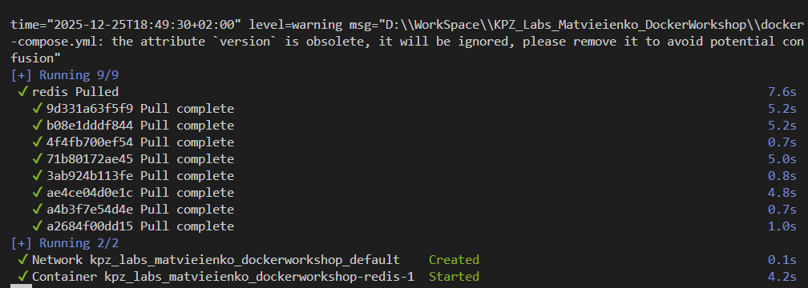
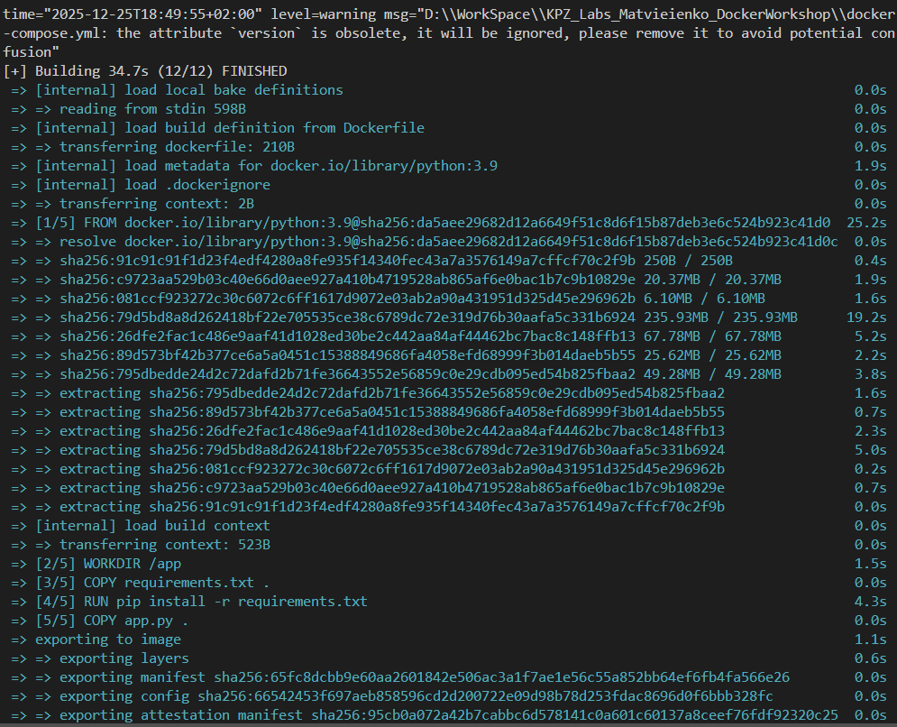
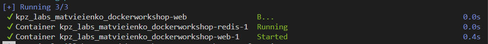
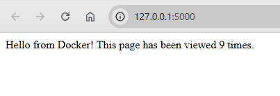

# KPZ Labs · Docker Workshop

Практична робота з Dockerfile та Docker Compose для Flask + Redis застосунку.  

## ℹ️ Опис проєкту

Репозиторій містить приклад мікросервісної міні-системи з двох контейнерів:

- веб-застосунок на Flask; 
- Redis як сховище даних для простого лічильника відвідувань.

Сервіси збираються за допомогою Dockerfile та запускаються разом через Docker Compose у спільній мережі.

## 👩‍💻 Автор

- Виконала: Матвєєнко Олександра  
- Група: ІПЗ-3.03  
- Дисципліна: "Конструювання програмного забезпечення" (КПЗ)

## 📁 Структура проєкту

```
.
├── app.py
├── Dockerfile
├── docker-compose.yml
└── requirements.txt
```

## 🧩 Використані технології

- Python 3.9
- Flask 3.1.0
- Redis 7
- Docker / Docker Compose

## 🚀 Запуск проєкту

Переконайтеся, що встановлено Docker та Docker Compose.

1. Клонувати репозиторій:
	```bash
	git clone https://github.com/Allaandra/KPZ_Labs_Matvieienko_DockerWorkshop.git
	cd KPZ_Labs_Matvieienko_DockerWorkshop
	```

2. Зібрати та запустити контейнери:
	```bash
	docker compose up --build
	```

3. Відкрити застосунок у браузері:
	```
	http://127.0.0.1:5000
	```

4. Зупинити роботу контейнерів:
	```bash
	Ctrl + C
	docker compose down
	```

## ⚙️ Логіка роботи лічильника

- На кореневому маршруті Flask (`/`) відображається лічильник відвідувань.
- При кожному оновленні сторінки для поточного клієнта значення лічильника збільшується на 1.
- Значення зберігається в Redis, що дозволяє зберігати його між перезапусками Flask-контейнера.

## 🐳 Dockerfile та docker-compose

- `Dockerfile` описує середовище для Flask-застосунку: базовий образ, робочу директорію, копіювання файлів, встановлення залежностей, відкритий порт і команду запуску.
- `docker-compose.yml` описує, як одночасно запускаються декілька контейнерів (Flask та Redis), як вони об'єднані в мережу, які порти проброшені тощо.

## 📸 Скріншоти

Запуск Docker Compose:





Стан контейнера в Docker:


Сторінка з лічильником:



## ✅ Висновки

У ході виконання практичної роботи був створений Docker-образ Flask-додатка, налаштовано сервіс Redis та реалізовано запуск застосунку через Docker Compose. У результаті отримано повністю робочий веб-застосунок Flask + Redis у контейнерах Docker з коректно налаштованими Dockerfile та docker-compose.

Завдяки Dockerfile Docker "знає", як зібрати образ застосунку та яке середовище потрібно для його коректної роботи. Docker Compose, у свою чергу, описує, як одночасно запускаються та взаємодіють кілька контейнерів у спільній мережі.

При переході за адресою `127.0.0.1:5000` у браузері користувач бачить сторінку з лічильником відвідувань, що реалізований за допомогою Redis і збільшується при кожному оновленні сторінки.
